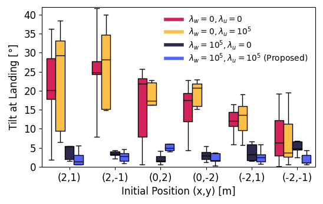
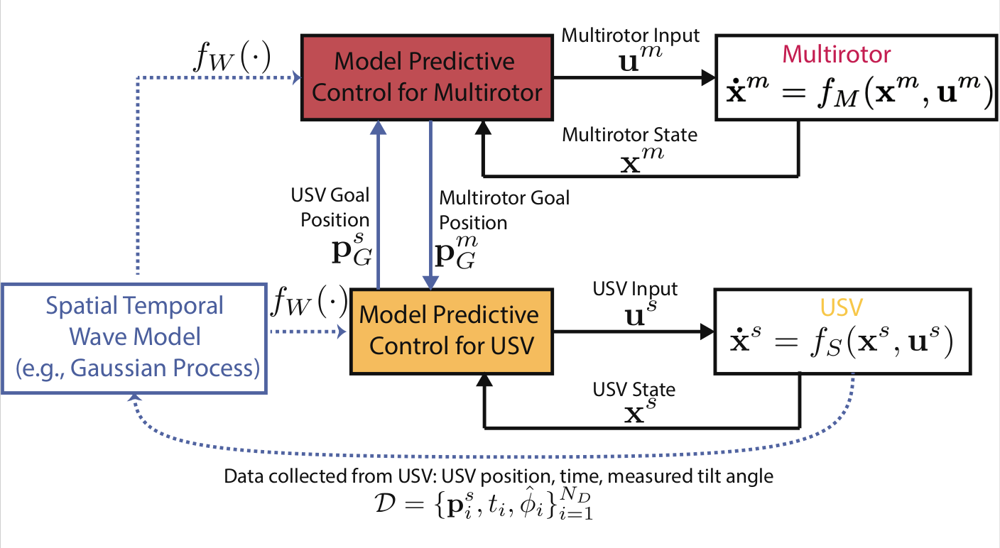
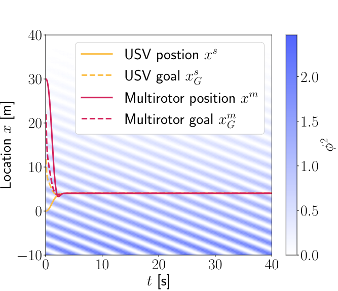
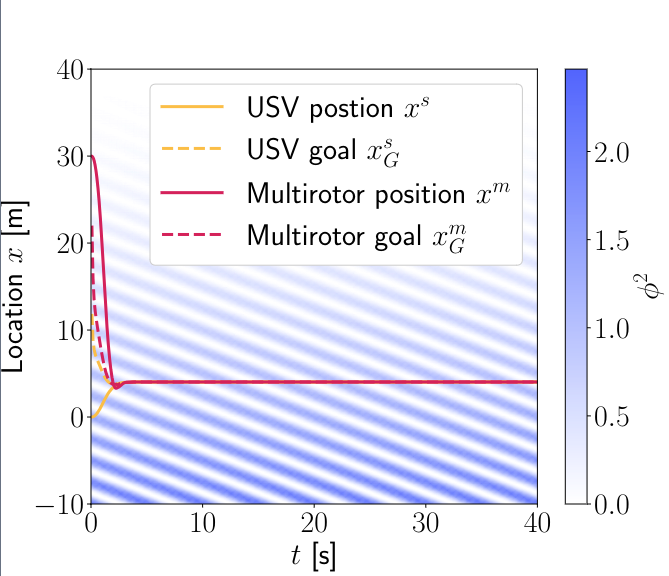
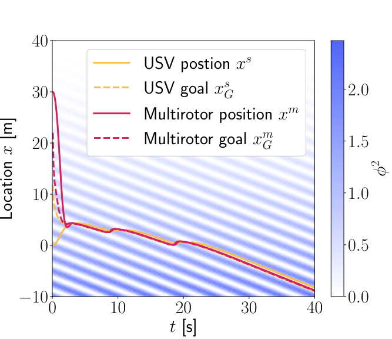

Welcome to the Tiny Learning-Based MPC project! This page covers the progress made on this project to date by members of [Robora Lab](https://roboralab.com/).

---
### Background
Autonomous teams of multirotors and uncrewed surface vessels (USVs) are invaluable to challenging maritime applications, including remote monitoring, search-and-rescue, and surveillance [1], [2], [3]. After deployment in a remote setting, the functional life of the system is ultimately limited by the battery-life of the multirotor. The research that we continue to investigate in this project is the ability to autonomously land a multirotor on a USV for recharging. We address this problem with safe control algorithms and apply control schemes in simulation, testbed validation, and real-world experiments.

Operating in unknown and variable marine conditions, USVs are subject to complex wave-induced motions that include effects on pitch, roll, yaw, sway, surge, and heave [4]. To prevent damage to the multirotor due to severe motion in these degrees of freedom, it must perform a safe and controlled landing [5]. In a robust landing solution, we must consider the variability of the amplitude and frequency of waves due to changing meteorological conditions. We leverage the Great Lakes Coastal Forecasting System to define the range of waves in which our system should succeed.

Contributions of the project are listed below from newest to oldest.

---
### Tiny Learning-Based MPC for Multirotors: Solver-Aware Learning for
Efficient Embedded Predictive Control [Summer 2024]
##### Submmited to RA-L. Check out the paper [here](https://arxiv.org/pdf/2410.23634)!
Tiny aerial robots show promise for applications
like environmental monitoring and search-and-rescue but face
challenges in control due to their limited computing power
and complex dynamics. Model Predictive Control (MPC) can
achieve agile trajectory tracking and handle constraints. Al-
though current learning-based MPC methods, such as Gaussian
Process (GP) MPC, improve control performance by learn-
ing residual dynamics, they are computationally demanding,
limiting their onboard application on tiny robots. This paper
introduces Tiny Learning-Based Model Predictive Control (LB
MPC), a novel framework for resource-constrained micro mul-
tirotor platforms. By exploiting multirotor dynamics’ structure
and developing an efficient solver, our approach enables high-
rate control at 100 Hz on a Crazyflie 2.1 with a Teensy 4.0
microcontroller. We demonstrate a 23% average improvement
in tracking performance over existing embedded MPC methods,
achieving the first onboard implementation of learning-based
MPC on a tiny multirotor (53 g).


<!-- Top Row: Image + Video Side by Side -->

  <!-- Figure 1 Image -->
  <figure style="flex: 1; min-width: 300px; text-align: center;">
    
    <figcaption style="margin-top: 8px; font-style: italic; color: #555;">
      Tilt of the platform at landing in harsh wave conditions. Our proposed approach (blue) achieves a lower tilt at landing over the approach that neglects tilt (red).
    </figcaption>
  </figure>

  <!-- Embedded YouTube Video -->
  <figure style="flex: 1; min-width: 300px; text-align: center;">
    

      <iframe src="https://www.youtube.com/embed/g4cCmE9Rgxs"
              style="position: absolute; top: 0; left: 0; width: 100%; height: 100%;"
              frameborder="0"
              allowfullscreen>
      </iframe>
    

    <figcaption style="margin-top: 8px; font-style: italic; color: #555;">
      Accompanying video.
    </figcaption>
  </figure>

<!-- Second Row: 3 Figure 1 Images Side-by-Side -->

<figure style="flex: 1; min-width: 250px; text-align: center;">
  
  <figcaption style="margin-top: 8px; font-style: italic; color: #555;">
    Custom tilting platform for ground vehicles. The platform mimics the spatial-temporal tilting motion of a USV in waves.
  </figcaption>
</figure>



---
### Distributed Model Predictive Control for Cooperative Multirotor Landing on Uncrewed Surface Vessel in Waves [Winter 2024]
##### Accepted as a contributing paper at the 2024 International Conference on Unmanned Aircraft Systems (ICUAS). Check out the paper [here](https://ieeexplore.ieee.org/document/10557042)!
We perform safe autonomous landing in simulation using a distributed model predictive control (MPC) scheme. Our proposed architecture combines standard tracking MPCs for the multirotor and USV and augments them with additional artificial goal locations. These artificial goals enable the vehicles to coordinate without prior guidance. Each vehicle solves an individual optimization problem for both the artificial goal and an input that tracks it but only communicates the former to the other vehicle. To account for harsh waters our distributed MPC integrates a spatial-temporal wave model in the cost function encouraging the agents to converge to calmer waters. The wave model maps the location and time to the tilt of the USV. We show in simulation how our approach can simultaneously coordinate in real-time both a safe landing location and execute the landing task for a multirotor on a USV under wave conditions.

We consider three strategies **"Cooperative"**, **"Calm"**, and **"Ride the Wave"**. The "Cooperative" strategy does not include a tilt cost, the "Calm" strategy includes a long-term spatial tilt cost, and the "Ride the Wave" strategy includes a short-term spatial tilt cost.


<!-- Top Row: Image + Video Side by Side -->

  <!-- Figure 1 Image -->
  <figure style="flex: 1; min-width: 300px; text-align: center;">
    
    <figcaption style="margin-top: 8px; font-style: italic; color: #555;">
      Block diagram of our proposed distributed MPC.
    </figcaption>
  </figure>

  <!-- Embedded YouTube Video -->
  <figure style="flex: 1; min-width: 300px; text-align: center;">
    

      <iframe src="https://www.youtube.com/embed/nBaHKCH9xOY"
              style="position: absolute; top: 0; left: 0; width: 100%; height: 100%;"
              frameborder="0"
              allowfullscreen>
      </iframe>
    

    <figcaption style="margin-top: 8px; font-style: italic; color: #555;">
      Recording of ICUAS 2024 presentation materials.
    </figcaption>
  </figure>

<!-- Second Row: 3 Figure 1 Images Side-by-Side -->

  <figure style="flex: 1; min-width: 250px; text-align: center;">
    
    <figcaption style="margin-top: 8px; font-style: italic; color: #555;">
      "Cooperative" Strategy.
    </figcaption>
  </figure>

  <figure style="flex: 1; min-width: 250px; text-align: center;">
    
    <figcaption style="margin-top: 8px; font-style: italic; color: #555;">
      "Calm" Strategy.
    </figcaption>
  </figure>

  <figure style="flex: 1; min-width: 250px; text-align: center;">
    
    <figcaption style="margin-top: 8px; font-style: italic; color: #555;">
      "Ride the Wave" Strategy.
    </figcaption>
  </figure>



---
### References
[1]	Y. Wang, W. Liu, J. Liu, and C. Sun, “Cooperative USV–UAV marine search and rescue with visual navigation and reinforcement learning-based control,” ISA Trans., vol. 137, pp. 222–235, 2023.

[2]	J. Wu, R. Li, J. Li, M. Zou, and Z. Huang, “Cooperative unmanned surface vehicles and unmanned aerial vehicles platform as a tool for coastal monitoring activities,” Ocean Coast. Manag., vol. 232, p. 106421, 2023.

[3]	A. Vasilijevic et al., “Heterogeneous robotic system for underwater oil spill survey,” in OCEANS 2015 - Genova, pp. 1–7, 2015.

[4]	T. I. Fossen, Handbook of marine craft hydrodynamics and motion control. John Wiley & Sons, 2011.

[5]	K. Xia, M. Shin, W. Chung, M. Kim, S. Lee, and H. Son, “Landing a quadrotor UAV on a moving platform with sway motion using robust control,” Control Eng. Pract., vol. 128, p. 105288, 2022.
