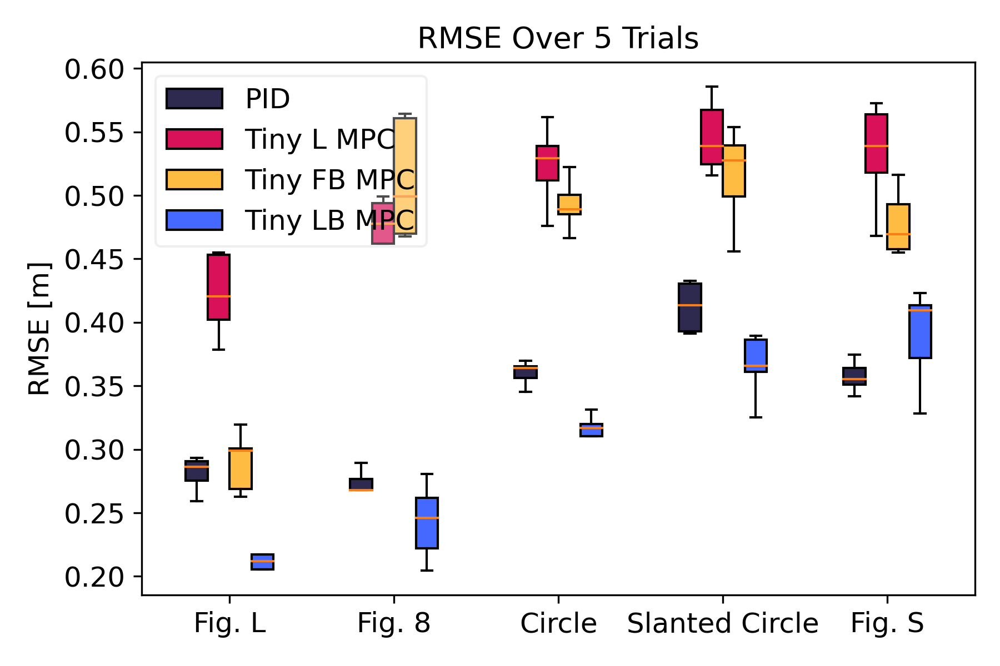
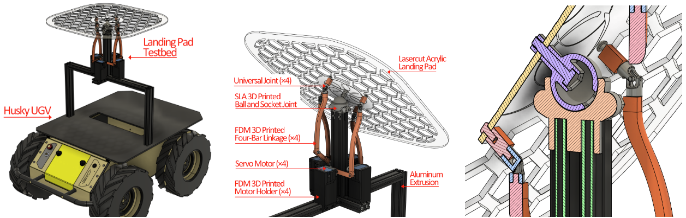
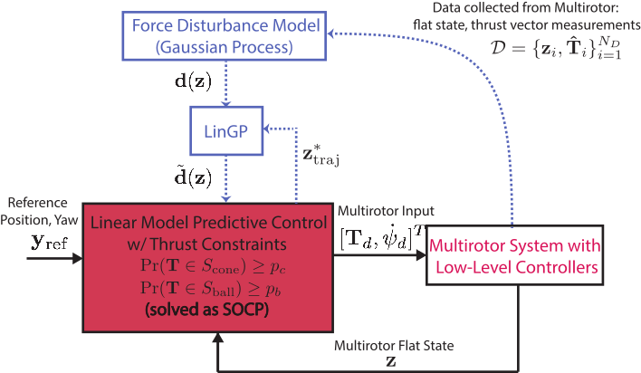

Welcome to the Tiny Learning-Based MPC project! This page covers the progress made on this project to date by members of [Robora Lab](https://roboralab.com/).

---
### Background
Micro aerial vehicles (MAVs), such as quadrotors, are increasingly critical in applications requiring agile, autonomous navigation in constrained and dynamic environments—ranging from search-and-rescue to environmental monitoring. However, achieving robust and high-performance control on these platforms is challenging due to two fundamental limitations: the effects of unmodeled aerodynamic disturbances at high speeds, and the severe computational constraints of onboard processors, especially in sub-100 g multirotors like the Crazyflie 2.1.

The research in this project addresses both challenges by developing learning-based Model Predictive Control (MPC) algorithms that are not only aware of the complex, nonlinear aerodynamics affecting multirotor flight, but also designed to run in real time on embedded microcontrollers. Traditional flatness-based planning and control methods for multirotors often assume simplified dynamics, neglecting the nonlinear and input-dependent effects of aerodynamic forces such as drag. These simplifications result in poor tracking performance and feasibility issues, particularly during aggressive maneuvers or in windy environments.

To overcome this, we learn the mapping from flat outputs to multirotor thrust using Gaussian Processes (GPs), enabling the controller to anticipate and adapt to aerodynamic disturbances. This GP-enhanced representation allows us to formulate a convex MPC problem, efficiently solved as a second-order cone program (SOCP), while retaining guarantees on physical feasibility. Moreover, to meet the tight resource constraints of small platforms, we design solver-aware implementations of learning-based MPC that achieve control rates of up to 100 Hz on a 53 g Crazyflie with a Teensy 4.0 processor.

Contributions of the project are listed below from newest to oldest.

---
### Tiny Learning-Based MPC for Multirotors: Solver-Aware Learning for Efficient Embedded Predictive Control [Summer 2024]
##### Submmited to RA-L. Check out the paper [here](https://arxiv.org/pdf/2410.23634)!
Tiny aerial robots show promise for applications
like environmental monitoring and search-and-rescue but face
challenges in control due to their limited computing power
and complex dynamics. Model Predictive Control (MPC) can
achieve agile trajectory tracking and handle constraints. Al-
though current learning-based MPC methods, such as Gaussian
Process (GP) MPC, improve control performance by learn-
ing residual dynamics, they are computationally demanding,
limiting their onboard application on tiny robots. This paper
introduces Tiny Learning-Based Model Predictive Control (LB
MPC), a novel framework for resource-constrained micro mul-
tirotor platforms. By exploiting multirotor dynamics’ structure
and developing an efficient solver, our approach enables high-
rate control at 100 Hz on a Crazyflie 2.1 with a Teensy 4.0
microcontroller. We demonstrate a 23% average improvement
in tracking performance over existing embedded MPC methods,
achieving the first onboard implementation of learning-based
MPC on a tiny multirotor (53 g).


<!-- Top Row: Image + Video Side by Side -->

  <!-- Figure 1 Image -->
  <figure style="flex: 1; min-width: 300px; text-align: center;">
    
    <figcaption style="margin-top: 8px; font-style: italic; color: #555;">
      Comparison of RMSE (over 5 trials) for PID
      (black) and three embedded predictive controllers: Tiny L MPC (red), Tiny
      FB MPC (yellow), and our proposed Tiny LB MPC (blue) for L Shape,
      Figure 8, Slanted Circle, and Figure S trajectories.
    </figcaption>
  </figure>

<!-- Second Row: 3 Figure 1 Images Side-by-Side -->

<figure style="flex: 1; min-width: 250px; text-align: center;">
  
  <figcaption style="margin-top: 8px; font-style: italic; color: #555;">
    Custom tilting platform for ground vehicles. The platform mimics the spatial-temporal tilting motion of a USV in waves.
  </figcaption>
</figure>



---
### A Computationally Efficient Learning-Based Model Predictive Control for Multirotors under Aerodynamic Disturbances [Winter 2024]
##### Accepted as a contributing paper at the 2024 International Conference on Unmanned Aircraft Systems (ICUAS). Check out the paper [here](https://ieeexplore.ieee.org/stamp/stamp.jsp?arnumber=10557089)!
Neglecting complex aerodynamic effects hinders
high-speed yet high-precision multirotor autonomy. In this
paper, we present a computationally efficient learning-based
model predictive controller that simultaneously optimizes a
trajectory that can be tracked within the physical limits
(on thrust and orientation) of the multirotor system despite
unknown aerodynamic forces and adapts the control input.
To do this, we leverage the well-known differential flatness
property of multirotors, which allows us to transform their
nonlinear dynamics into a linear model. The main limitation of
current flatness-based planning and control approaches is that
they often neglect dynamic feasibility. This is because these
constraints are nonlinear as a result of the mapping between
the input, i.e., multirotor thrust, and the flat state. In our
approach, we learn a novel representation of the drag forces by
learning the mapping from the flat state to the multirotor thrust
vector (in a world frame) as a Gaussian Process (GP). Our
proposed approach leverages the properties of GPs to develop
a convex optimal controller that can be iteratively solved as a
second-order cone program (SOCP). In simulation experiments,
our proposed approach outperforms related model predictive
controllers that do not account for aerodynamic effects on
trajectory feasibility, leading to a reduction of up to 55% in
absolute tracking error.


<!-- Top Row: Image + Video Side by Side -->

  <!-- Figure 1 Image -->
  <figure style="flex: 1; min-width: 300px; text-align: center;">
    
    <figcaption style="margin-top: 8px; font-style: italic; color: #555;">
      Block diagram of our proposed learning-based MPC architecture.
    </figcaption>
  </figure>

<!-- Two Videos Side-by-Side -->

  

    <video controls style="width: 100%; border-radius: 8px;">
      <source src="assets/w=2animationn.mp4" type="video/mp4">
      Your browser does not support the video tag.
    </video>
    

      SOCP No Learning
    

  

  

    <video controls style="width: 100%; border-radius: 8px;">
      <source src="assets/w=2animationl.mp4" type="video/mp4">
      Your browser does not support the video tag.
    </video>
    

      SOCP Learning
    

  



<!-- --- -->
<!-- ### References
[1]	Y. Wang, W. Liu, J. Liu, and C. Sun, “Cooperative USV–UAV marine search and rescue with visual navigation and reinforcement learning-based control,” ISA Trans., vol. 137, pp. 222–235, 2023. -->