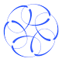

# My Project Title

Welcome! This site showcases three parts of my project:

---

## 🚀 Part 1: Aerial Landing

A control framework for safe multirotor landings on inclined or dynamic platforms.  
Explores MPC, CLFs, and safety-critical reinforcement learning.

---

## 🌊 Part 2: USV Wave Modeling

We model surface wave dynamics to anticipate disturbances and enable real-time adaptation.  
Includes wave prediction using Gaussian Processes and online learning.

---

## 🤖 Part 3: Multi-Agent Coordination

Two robots cooperate to share goals and adapt behavior using distributed model predictive control.  
We explore strategies for safe and robust coordination under uncertainty.

---
